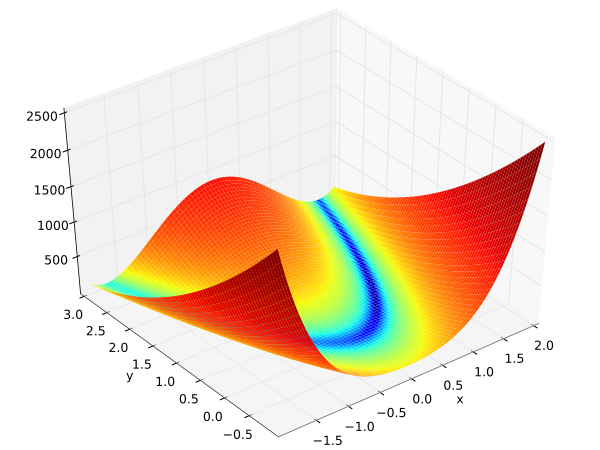
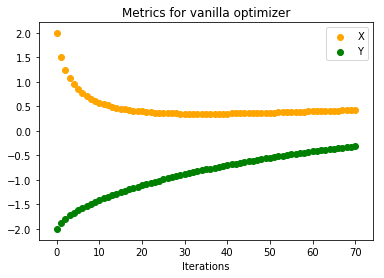
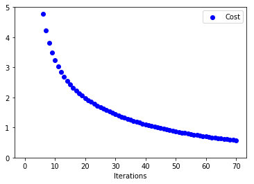
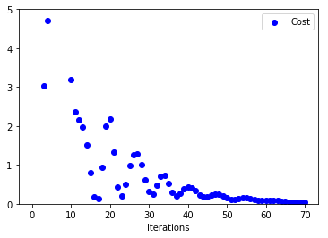
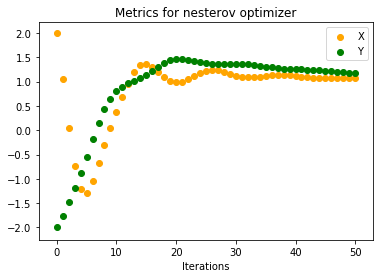
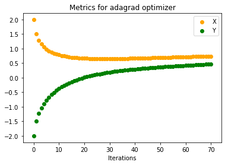
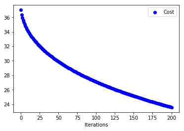
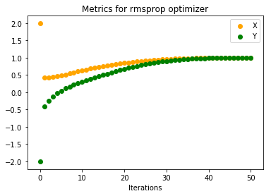
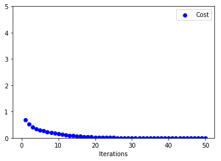

+++
date = "2017-04-20T00:05:01-04:00"
title = "Gradient Descent Optimizations"
tags = [ "Machine Learning", "Gradient Descent", "Python"]
categories = [ "Machine Learning" ]
project_url = "https://github.com/ndeepesh/ML-Code/blob/master/SGD-Optimizations.ipynb"
+++

<b>Note:</b>
All the code here is also available in this [notebook](https://github.com/ndeepesh/ML-Code/blob/master/experiments/GradientDescentOptimizations.ipynb). Variable names will be different in notebook then here. <br/>

In this blog post we'll talk about how different flavours of Gradient Descent help improve convergence of a function. [Rosenbrock Function](https://en.wikipedia.org/wiki/Rosenbrock_function) was taken for this experiment. It is a non-convex function, the one that we encounter regularly as *Cost Functions* in machine learning problems.
           <center>_**Rosenbrock Function(Source: Wikipedia)**_</center><br/>


1. Rosenbrock Function:  $C(x, y) = (a-x)^2 + b(y-x^2)^2$ <br/>
2. For this experiment values of both <i>a</i> and <i>b</i> is 1<br/>
3. Minimum value of Rosenbrock function then is 0 at (1, 1)<br/>
4. Gradient of Rosenbrock Function w.r.t <i><b>x</b></i> and <i><b>y</b></i> is below(we need them in Gradient Descent) <br/>
<center><i>der_Cx(x,y)</i> = $\frac{dC}{dx} = -2(a-x)- 4bx(y-x^2)$, <br/> <i>der_Cy(x,y)</i> = $\frac{dC}{dy} = 2b(y-x^2)$</center>
5. For Gradient Descent we need a starting point. For this experiment (x, y) = (2, -2) <br/>


**Vanilla Gradient Descent** <br/>
   Vanilla Gradient Descent updates the function parameters(in our case its *x* and *y*) by simply going in the direction of greatest descent. It controls this with a hyperparameter named *learning-rate*. Below is the code for it. <br/>
   
```python
	learningRate = 0.01
	for ite in range(iterations):
		x -= learningRate*der_Cx(x, y)
		y -= learningRate*der_Cy(x, y)
```
Below are the plots on how <i>x</i>, <i>y</i> and <i>C</i> vary with number of iterations <br/>

 <br/>

When the number of iterations are very small(70 in this case) we see that our function converges very slowly to minimum. Below are the plots when number of iterations were increased(to 1000). We can see that both parameters converge to minimum value.<br/>


 <br/>

**Gradient Descent with Momentum** <br/>
	Intuition behind introducing momentum in Gradient Descent stems from the fact that we are moving downhill in our cost function. When adding momentum we give impetus to our parameters to reach bottom quickly. We do this by accumulating all previous gradients and scaling it down using <i>MomentumRate</i>. Imagine like a big snowball falling from a mountain. As it goes down it gains more momentum. Code is below: <br/>
   
```python
	learningRate, momentumTerm = 0.01, 0.9
	momentum_x, momentum_y = 0, 0
	for ite in range(iterations):
		momentum_x = momentumTerm*momentum_x + learningRate*der_Cx(x, y)
		momentum_y = momentumTerm*momentum_y + learningRate*der_Cy(x, y)
		x -= momentum_x
		y -= momentum_y
```
Below are the plots on how <i>x</i>, <i>y</i> and <i>C</i> vary with number of iterations <br/>

 <br/>

We see that both <i>x</i>, <i>y</i> are converging to (1, 1) much faster than vanilla gradient descent. If we look at the other curve(one on the right) we can see that for initial iterations there are huge oscillations in cost function before it converges to a value of 0. <br/>

**Gradient Descent with Nesterov Momentum** <br/>
Nesterov Momentum is a variant of momentum concept. If we look at the momentum update closely, there is a way to know which direction we might be moving downhill before actually moving there. Momentum update can be expressed as $$momentum = momentumRate*momentum + learningRate*gradient$$ and our parameter update as $$param  -= momemtum$$ So even before performing the parameter update we know that it will be app. in the direction of $param - momentumRate*momentum$. We can use this information and calculate the gradient of cost function w.r.t. $(param - momentumRate*momentum)$ rather than $param$. Below is the code for same. See [1](# https://www.reddit.com/r/MachineLearning/comments/3rbxyw/whats_the_difference_between_momentum_based/) and [2](https://blogs.princeton.edu/imabandit/2015/06/30/revisiting-nesterovs-acceleration/) for exact Nesterov update as in code below. <br/>

```python
	learningRate, momentumTerm = 0.01, 0.9
	momentum_x, momentum_y = 0, 0
	for ite in range(iterations):
		momentum_x = (momentumTerm**2)*momentum_x + (1 + momentumTerm)*learningRate*der_Cx(x, y)
		momentum_y = (momentumTerm**2)*momentum_y + (1 + momentumTerm)*learningRate*der_Cy(x, y)
		x -= momentum_x
		y -= momentum_y
```

Below are the plots on how <i>x</i>, <i>y</i> and <i>C</i> vary with number of iterations <br/>

<br/>

Looking at how Cost varies with iterations, we can see that there is some sort of stability right from start compared to previous approach. Also, both <i>x</i>, <i>y</i> converge to minimum in around 50 iterations compared to 70 iterations. Intuitively our ball is now rolling with some knowledge on where to head next.


**Adagrad** <br/>
Imagine that our machine learning problem has 2 features and one of them is very sparse. This means that during gradient descent it will have less number of updates compared to the feature that occur more frequently. This would not be an ideal situation since that sparse feature can be very important. Because it moves very slowly it may never reach its minimum value. Adagrad is an adaptive learning rate approach that tackles this problem. It divides the learning rate of a parameter by square root of sum of squares of all its previous gradients. Below is the code for it.

```python
	learningRate, epsilon = 0.5, 1e-8
	all_grads_squared_x, all_grads_squared_y = 0, 0
	for ite in range(iterations):
		all_grads_squared_x += der_Cx**2
		all_grads_squared_y += der_Cy**2
		x -= (learningRate/np.sqrt(all_grads_squared_x) + epsilon)*der_Cx
		y -= (learningRate/np.sqrt(all_grads_squared_y) + epsilon)*der_Cy
```
Below are the plots on how <i>x</i>, <i>y</i> and <i>C</i> vary with number of iterations <br/>

 <br/>

Even without momentum this is faster than Vanilla Gradient Descent. Problem with Adagrad is that its parameter update is very aggressive. If the denominator term grows huge eventually learning will stop since the updates to parameters will be infinitesimal. Also, one thing to notice for adaptive learning rates is that if we choose a small learning rate initially (here we have chosen 0.5 rather then 0.01) then learning stops very early. Below plots justify this. Updates to parameters are very small(Initial Learning Rate for below plot = 0.01)


 <br/>

**RMSProp** <br/>
RMSProp tries to mitigate the above problem by using only previous <i>k</i> gradients. Rather than storing previous <i>k</i> gradients it uses a decaying average of all previous gradients. Below is the code for it. <br/>

```python
	learningRate, decayingRate , epsilon = 0.5, 0.9, 1e-8
	all_grads_squared_x, all_grads_squared_y = 0, 0
	for ite in range(iterations):
		all_grads_squared_x = decayingRate*all_grads_squared_x + (1 - decayingRate)*der_Cx**2
		all_grads_squared_y = decayingRate*all_grads_squared_y + (1 - decayingRate)*der_Cy**2
		x -= (learningRate/np.sqrt(all_grads_squared_x) + epsilon)*der_Cx
		y -= (learningRate/np.sqrt(all_grads_squared_y) + epsilon)*der_Cy
```
Below are the plots on how <i>x</i>, <i>y</i> and <i>C</i> vary with number of iterations <br/>

 <br/>

We can see that it reaches convergence much faster than Adagrad. <br/><br/>

<b>More Resources</b><br/>
1. Sebastian Ruder [Optimizing Gradient Descent](http://sebastianruder.com/optimizing-gradient-descent/) <br/>
2. Stanford's CS-231 class notes on  [Gradient Descent](http://cs231n.github.io/neural-networks-3/)
