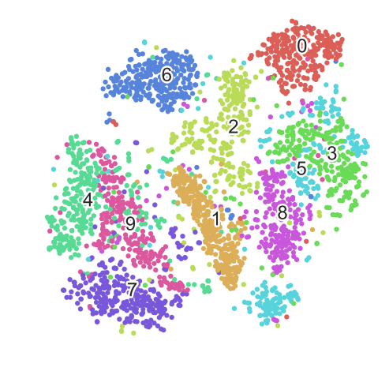

+++
date = "2017-07-05T00:05:01-04:00"
title = "tSNE"
tags = ["Dimensionality Reduction", "Python"]
categories = [ "Machine Learning" ]
project_url = "https://github.com/ndeepesh/MachineLearning-Experiments/blob/master/experiments/tSNE.ipynb"
+++

Recently, I came across an interesting non-linear visualization or dimensionality reduction method - tSNE(Distributed Stochastic Neighbour Embedding). [Here](http://www.jmlr.org/papers/volume9/vandermaaten08a/vandermaaten08a.pdf) is the original paper describing the method in much more detail. I thought i'll implement this from scratch. In this post I am sharing the code with extensive comments :)

Before moving onto the code, here is a brief overview of how it works. tSNE is just like PCA where you can reduce the dimensionality of data to 2 or 3 dimensions to visualize it. But unlike PCA, tSNE does that using non-linear ways. It converts everything to probability distributions. Next I'll list down the steps on a high level for a bigger picture. <br/>
1. Assume we have points of shape=(n, m). We'll call this original or higher dimension<br/>
2. We need to convert these points to shape=(n, 2). We'll call this lower or embedded dimension.<br/>
3. Calculate Pairwise similarity matrix for all data points(example eculedian distance between all pairs)<br/>
4. Each point is then converted to a probability distribution using the above similarity matrix<br/>
5. Now, we initialize n points using a normal distribution but in the lower dimension.<br/>
6. Again we convert these new points to a probability distribution<br/>
7. Finally, run gradient-descent on the two distributions(point 4 and 6) with kl-divergence between them as the cost function <br/>

Below is the code. Hope it helps. <br/>

```python
# Main Function Entry
def tSNE(data, req_dims=2, intermediate_dims=2, perplexity=20.0):
    (n, d) = data.shape
        
    # Calculate the Squared Pairwise Eucledian Distance Matrix
    eucledian_simi_matrix = euclidean_distances(data)**2
    assert(eucledian_simi_matrix.shape == (n, n))
    
    # beta = 1/2*square(variance) -> Initialize beta's to 1 => variance = 1/sqrt(2)
    # Variance is of the Gaussian Distribution. Each point will have its own gaussian-distribution, thus n variances 
    beta = np.ones((n, 1))
    
    # Perplexity(of a distribution) = 2^entropy => entropy = log(perplexity)
    entropy = np.log(perplexity)
    
    # Initialize the Conditional Gaussian Distribution for all points as 0
    # p(i|j) = (e^(-||xi - xj||^2)/2*variance^2) / summation(e^(-||xi - xm||^2)/2*variance^2)
    # p(i|j) => Probability that point-i will choose point-j as its neighbour if points were selected from a 
    #           gaussian distribtion centered at point-i
    gaussian_cond_dis = np.zeros((n, n))
    
    # In this for loop we find optimal beta(thus variance) for each point's gaussian distribution
    # This is done using binary search. We are given a desired perplexity(and thus entropy)
    # What we do is first we calculate the entropy given our initialized beta(above) and see whether we need to
    # increase or decrease beta to reach the desired perplexity for each individual point
    for point in range(n):
        if(point % 100 == 0): print("Completed calculating Prob. Distributions of " + str(point) + " data points")
        
        # We remove the self-distance in eucledian matrix
        mofified_simi = eucledian_simi_matrix[point][np.r_[0:point, point+1:n]]
        point_entropy, prob_dis = calculateEntrAndProbDis(mofified_simi, beta[point])
        diff = point_entropy - entropy
        attempts = 0
        
        min_beta = -np.inf
        max_beta = np.inf
        
        # Here we do a Binary Search on Beta Values(Remember: beta = 1/2*sqrt(variance))
        # If difference > 0 => Increase Beta else Decrease. this is done till some predefined number of attempts
        while(np.absolute(diff) > 1e-5 and attempts < 50):
            if(diff > 0):
                min_beta = beta[point] # our new minimum for binary search
                if(max_beta == np.inf or max_beta == -np.inf):
                    beta[point] = beta[point] * 2
                else:
                    beta[point] = (beta[point] + max_beta)/2 #Somewhere between current and max
            else:
                max_beta = beta[point] # our new max for binary search
                if(min_beta == np.inf or min_beta == -np.inf):
                    beta[point] = beta[point] / 2
                else:
                    beta[point] = (beta[point] + min_beta)/2 #Between current and minimum

            attempts += 1
            
            # Do the drill again till we run out of attempts or we get a very good beta(thus variance)
            point_entropy, prob_dis = calculateEntrAndProbDis(mofified_simi, beta[point])
            diff = point_entropy - entropy

        gaussian_cond_dis[point][np.r_[0:point, point+1:n]] = prob_dis

    print("Mean Beta Value = " + str(np.mean(np.sqrt(1/beta))))
    
    # Symmetric Joint Probability Matrix (For points in Higher Dimension). Symmetric SNE
    joint_prob_matrix = (gaussian_cond_dis + gaussian_cond_dis.T)/(2*n)
    assert(joint_prob_matrix.shape == (n, n))
    
    # Early exagerration here(this is a very important optimization step)
    joint_prob_matrix = joint_prob_matrix*4
    joint_prob_matrix = np.maximum(joint_prob_matrix, 1e-12);
    
    # Sample Initial Map Points from Normal Distribution with mean 0 and variance 10^-4
    map_pts = np.random.randn(n, req_dims)
    
    # We search for optimal map points by using a gradient descent on KL Divergence between probability distributions
    # of higher and lower dimension. Map Points are already initialized as per normal function above
    epocs = 1000
    learn_rate = 0.9
    momentum = 0.5
    learning_decaying_rate = 0.9
    
    moment = np.zeros((n, req_dims))
    all_grads_squared = np.zeros((n, req_dims))
    
    # Get Gradient w.r.t to each map_point
    change_y = np.zeros((n, req_dims))
    iY = np.zeros((n, req_dims))
    gains = np.ones((n, req_dims))
    eta = 500
    
    # Student Distribution Fucntion
    student_func = lambda x: np.power(1 + x**2, -1) # Lambda for Student-t distribution
    
    for i in range(epocs):
        sys.stdout.write("\rProgress: {:2.1f}".format(100 * i/float(epocs)))
        
        if(i > 250): momentum = 0.8
            
        # Calculate the t-Distribution of map points
        tDistri = student_func(euclidean_distances(map_pts))
        np.fill_diagonal(tDistri, 0) # Again, only interested in pair-wise similarities
        sumTDist = np.sum(tDistri)
        joint_prob_t_distri = tDistri/sumTDist
        joint_prob_t_distri = np.maximum(joint_prob_t_distri, 1e-12)
        
        assert(joint_prob_t_distri.shape == (n, n))
        
        cost = np.sum(joint_prob_matrix*np.log(joint_prob_matrix/joint_prob_t_distri))
        if(i % 10 == 0): print(" Cost after " + str(i) + " iterations = " + str(cost))
        
        PQ = joint_prob_matrix - joint_prob_t_distri
        for j in range(n):
            # Gradient = 4*summation((pij - qij)*(yi- yj)*(1+||yi-yj||^2)^-1)
            diff_dis = np.reshape((PQ[j]), (n, 1))
            temp = diff_dis*np.reshape(tDistri[j], (n, 1))
            distances = map_pts[j] - map_pts
            change_y[j] = np.sum(temp*distances, 0)
            
        # Modify Map Points applying learn_rate, momentum and adaptive learning rates(Adam)
        all_grads_squared = learning_decaying_rate*all_grads_squared + (1 - learning_decaying_rate)*(change_y**2)
        moment = momentum*moment + (1-momentum)*change_y
        map_pts -= (learn_rate)/(np.sqrt(all_grads_squared) + 1e-8)*moment
        
        if(i == 100):
            joint_prob_matrix = joint_prob_matrix/4 # Remove effect of early exagerration
    
    assert(map_pts.shape == (n, req_dims))
    return map_pts

# Calculation here is a result of simplifying entropy and gaussian distribution equations
# Returns Entropy and Prob Distribution corresponding to that entropy for one point
def calculateEntrAndProbDis(D, beta):
    gaussian_dist = np.exp(-D.copy()*beta) # Numerator of Conditional Probability defined below
    sumProbDist = np.maximum(np.sum(gaussian_dist), 1e-10) # Denominator of Conditional Probability
    conditional_gaussian = gaussian_dist/sumProbDist

    entropy = np.sum(np.log(sumProbDist)*conditional_gaussian) + np.sum(conditional_gaussian*D)*beta
    return (entropy, conditional_gaussian)

```

Run tSNE on MNIST Data <br/>

```python
def scatter(x, colors):
    # We choose a color palette with seaborn.
    palette = np.array(sns.color_palette("hls", 10))

    # We create a scatter plot.
    f = plt.figure(figsize=(8, 8))
    ax = plt.subplot(aspect='equal')
    sc = ax.scatter(x[:,0], x[:,1], lw=0, s=40,
                    c=palette[colors.astype(np.int)])
    plt.xlim(-25, 25)
    plt.ylim(-25, 25)
    ax.axis('off')
    ax.axis('tight')

    # We add the labels for each digit.
    txts = []
    for i in range(10):
        # Position of each label.
        xtext, ytext = np.median(x[colors == i, :], axis=0)
        txt = ax.text(xtext, ytext, str(i), fontsize=24)
        txt.set_path_effects([
            PathEffects.Stroke(linewidth=5, foreground="w"),
            PathEffects.Normal()])
        txts.append(txt)

    return f, ax, sc, txts

X = np.loadtxt("../data/mnist/mnist2500_X.txt")
labels = np.loadtxt("../data/mnist/mnist2500_labels.txt")
Y = tSNE(X)

scatter(Y, labels)
plt.show()
```




